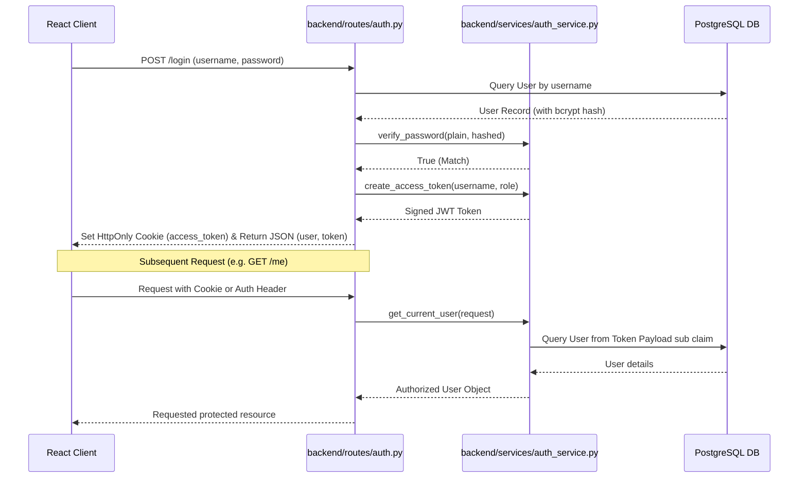
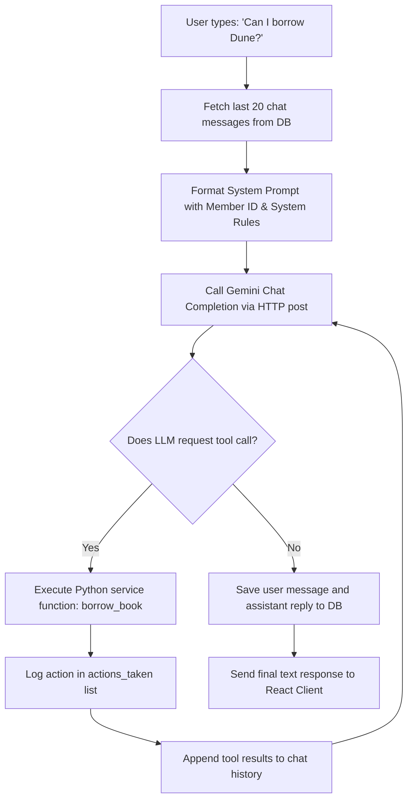

# Code Explanation: Cloud, Authentication, & AI Implementation

This document provides a line-by-line and architectural breakdown of the three core pillars of the Bibliotech application: **Cloud Infrastructure (Terraform & Docker)**, **Authentication Security (JWT & RBAC)**, and the **AI Conversational Agent (Gemini Function-Calling Loop)**.

---

## 1. Cloud Infrastructure & Deployment

The application is containerized using **Docker** and deployed to **Microsoft Azure** using **Terraform** for Infrastructure as Code (IaC).

### A. Docker Configurations

#### 1. Backend Dockerization (`Dockerfile` in root)
- Builds a lightweight Python container (`python:3.11-slim`).
- Installs PostgreSQL system dependencies (`libpq-dev gcc`) needed to compile database drivers.
- Copies `requirements.txt` and runs `pip install --no-cache-dir -r requirements.txt` to minimize layer sizes.
- Exposes port `8000` and starts the app with Uvicorn:
  ```bash
  CMD ["uvicorn", "backend.main:app", "--host", "0.0.0.0", "--port", "8000"]
  ```

#### 2. Local Multi-Container Orchestration (`docker-compose.yml` in root)
- Spins up a **PostgreSQL 16** database container mapping port `5432` to the host.
- Sets environment variables for the default user, password, and database (`library`).
- Mounts a volume (`pgdata:/var/lib/postgresql/data`) to persist library database data across container restarts.

---

### B. Azure Infrastructure Deployment (`terraform/main.tf`)

This file defines the entire Azure cloud architecture. It runs in a pipeline to provision resources in a secure, least-privilege, student-credit-friendly manner.

#### 1. Managed Identity & Key Vault RBAC (Lines 21-74)
- **`azurerm_user_assigned_identity`** creates a Managed Identity (`backend_identity`). Rather than using hardcoded username/password credentials in configuration files, the backend container app uses this identity to authenticate with other Azure services.
- **`azurerm_key_vault`** stores environment credentials (database passwords, JWT keys, and Gemini tokens).
- **`azurerm_role_definition`** (Least Privilege Role):
  ```hcl
  permissions {
    actions = ["Microsoft.KeyVault/vaults/read"]
    data_actions = [
      "Microsoft.KeyVault/vaults/secrets/getSecret/action",
      "Microsoft.KeyVault/vaults/secrets/readMetadata/action"
    ]
  }
  ```
  Instead of granting full Admin permissions, this custom role restricts access. The identity is only allowed to read secrets (no deleting or writing).
- **`azurerm_role_assignment`** binds this custom secrets-reader role to the backend Managed Identity, securing access to the Key Vault.

#### 2. PostgreSQL Flexible Server (Lines 101-128)
- Deploys a **PostgreSQL 16** Flexible Server instance using the cost-effective `B_Standard_B1ms` burstable VM SKU.
- **`azurerm_postgresql_flexible_server_firewall_rule`**:
  ```hcl
  start_ip_address = "0.0.0.0"
  end_ip_address   = "0.0.0.0"
  ```
  Configures the firewall to allow connections from other Azure services. This enables the Container Apps to connect to the database securely.

#### 3. Container App Backend & Secrets Ingestion (Lines 145-215)
- Provisions an Azure Container App (`backend`) with `revision_mode = "Single"`.
- Binds the Managed Identity to the Container App.
- Pulls secret values from the Key Vault dynamically and maps them to environment variables inside the container:
  ```hcl
  secret {
    name                = "database-url-secret"
    key_vault_secret_id = azurerm_key_vault_secret.db_url.id
    identity            = azurerm_user_assigned_identity.backend_identity.id
  }
  ```
  This keeps sensitive credentials secure, as they are never written in plain text in deployment logs.
- **Cost Saving Scaling**:
  ```hcl
  min_replicas = 0
  max_replicas = 1
  ```
  Sets `min_replicas = 0` to **scale the container to zero instances** when there is no incoming traffic. This pauses compute charges when the library is inactive, saving student credits.

#### 4. Container App Frontend (Lines 218-249)
- Provisions the frontend container.
- **`VITE_API_URL` Injection**:
  ```hcl
  env {
    name  = "VITE_API_URL"
    value = "https://${azurerm_container_app.backend.ingress[0].fqdn}"
  }
  ```
  Pulls the dynamic FQDN (Fully Qualified Domain Name) ingress URL from the backend Container App and injects it into the frontend's environment. This configures the React client to point to the correct backend host automatically.

---

## 2. Authentication Architecture (JWT & RBAC)

Authentication secures routes, controls permissions, and identifies members requesting AI actions.



### A. Password Hashing (Bcrypt)
Passwords are never stored in plain text.
- **Signup** (`backend/routes/auth.py`):
  Passes the user's password to `hash_password(user_data.password)` from `auth_service.py`. This uses `bcrypt.hashpw` with a random salt (`bcrypt.gensalt()`) to create a secure one-way hash.
- **Verification** (`backend/services/auth_service.py`):
  `verify_password` compares the submitted password against the stored database hash using `bcrypt.checkpw`. This process is resistant to timing attacks.

### B. JWT Signatures & Payload Schema
When a user logs in successfully, a JSON Web Token is generated:
```python
def create_access_token(subject: str, role: str, expires_delta: Optional[timedelta] = None) -> str:
    # subject = username
    # role = UserRole ("admin" or "member")
    to_encode = {
        "sub": subject,
        "role": role,
        "exp": expire.timestamp()
    }
    return jwt.encode(to_encode, settings.JWT_SECRET_KEY, algorithm=settings.JWT_ALGORITHM)
```
- Signed using the `HS256` HMAC-SHA256 algorithm and a server-side secret key.
- Tokens expire after 60 minutes (`JWT_EXPIRATION_MINUTES = 60`) to reduce risk if a key is intercepted.

### C. Session Delivery: Cookies & Header Authentication
To ensure compatibility across different environments (local development, production, and CLI testing), the backend supports two authentication methods:
1. **HttpOnly Cookie**:
   On login, the backend writes the JWT to a cookie named `access_token` with `httponly=True` and `samesite="lax"`. This protects the token from XSS-based local storage thefts.
2. **Authorization Header**:
   The backend also returns the token string in the JSON payload, which the frontend saves in `localStorage`.
3. **Dual-Extraction Middleware** (`backend/services/auth_service.py`):
   ```python
   # 1. Check Authorization header (Bearer token)
   auth_header = request.headers.get("Authorization")
   if auth_header and auth_header.startswith("Bearer "):
       token = auth_header.split(" ")[1]
   # 2. Fallback to HttpOnly Cookie
   if not token:
       token = request.cookies.get("access_token")
   ```
   Extracts the token from the header first (handy for React Query Axios queries or API debuggers like Swagger docs), and falls back to the HttpOnly cookie.

### D. FastAPI Role-Based Access Control (RBAC) Guard
REST endpoints are protected using dependencies that verify user roles:
```python
def require_role(allowed_roles: list[UserRole]):
    async def dependency(current_user: User = Depends(get_current_user)) -> User:
        if current_user.role not in allowed_roles:
            raise HTTPException(status_code=403, detail="Access denied.")
        return current_user
    return dependency

# Convenience Guards
require_admin = require_role([UserRole.ADMIN])
require_member = require_role([UserRole.MEMBER])
```
Adding `Depends(require_admin)` to a route signature blocks access for standard members. If an unauthorized user calls the endpoint, the route returns an `HTTP 403 Forbidden` response.

---

## 3. The AI Conversational Agent Loop

The AI library assistant is implemented using the Gemini API and a loop that supports multi-turn tool calling.



### A. OpenAI Compatibility Interface
The assistant uses the Gemini API via its OpenAI compatibility layer. The request is sent directly via `httpx.AsyncClient` to avoid dependency conflicts:
```python
url = f"https://generativelanguage.googleapis.com/v1beta/openai/chat/completions?key={settings.GEMINI_API_KEY}"
```
This enables the application to use standard chat models (`gemini-2.0-flash`) and JSON function-calling interfaces with a standard Google API key.

### B. Tool Schemas
Tools are registered as JSON schemas that describe their parameters and usage:
```json
{
  "type": "function",
  "function": {
    "name": "borrow_book",
    "description": "Borrow a book for the current user. Requires the integer ID of the book.",
    "parameters": {
      "type": "object",
      "properties": {
        "book_id": { "type": "integer", "description": "The unique integer ID of the book." }
      },
      "required": ["book_id"]
    }
  }
}
```
If the user asks "Can I borrow Dune?", the model processes the query and returns a structured tool call request instead of a standard text response:
```json
{
  "name": "borrow_book",
  "arguments": "{\"book_id\": 26}"
}
```

### C. Sequential Function-Calling Execution Loop
```python
# The loop runs up to 5 times per request to support multi-step tool calls
for _ in range(5):
    response_message = response.choices[0].message
    tool_calls = response_message.tool_calls

    if not tool_calls:
        break # Exit if the model responds with final text

    # Add the assistant's tool-call request to the context history
    messages.append({
        "role": "assistant",
        "content": response_message.content,
        "tool_calls": [...]
    })

    # Execute each tool requested by the model
    for tool_call in tool_calls:
        tool_name = tool_call.function.name
        tool_args = json.loads(tool_call.function.arguments)

        # Call the corresponding Python service function
        tool_output = await self.execute_tool_call(tool_name, tool_args)
        actions_taken.append(f"Called {tool_name} with {tool_args}")

        # Append the tool's output back to the conversation context
        messages.append({
            "role": "tool",
            "tool_call_id": tool_call.id,
            "name": tool_name,
            "content": tool_output
        })

    # Send the updated message history back to the model
    response = await self._call_gemini_completions(messages)
```

#### How it works:
1. **Context Loading**: The assistant loads the conversation context from the database (`ChatMessage` model) to maintain memory across turns.
2. **Sequential Decisions**: The model can request multiple tools in sequence. For example, if the user asks to borrow "Dune", the model first calls `search_catalog(search="Dune")`. It receives the search results, identifies the book ID as `26`, and then calls `borrow_book(book_id=26)` in the next iteration.
3. **Execution**: The backend processes the tool calls using `execute_tool_call` (lines 207-301), which interacts with the database via `book_service` and `loan_service`.
4. **Data Persistence**: Once the loop finishes, the user's message and the assistant's final response (including the list of actions taken) are saved to the database.
5. **State Invalidation**: The backend returns the list of actions taken to the client. This allows the frontend to detect changes (e.g. if the assistant borrowed or returned a book) and invalidate the corresponding queries, automatically refreshing the library catalog views.
